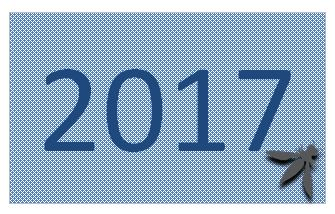
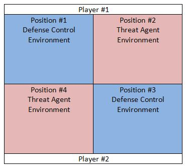
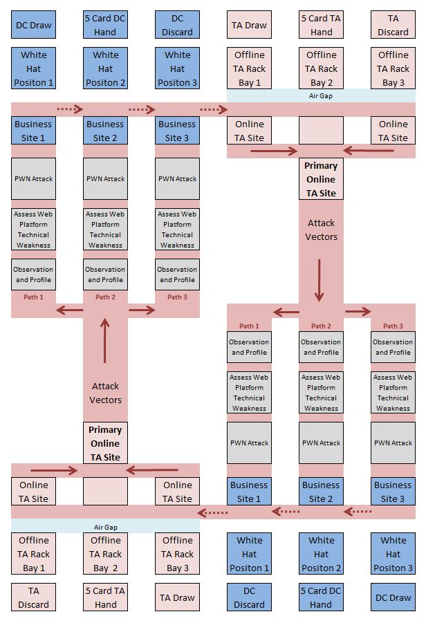
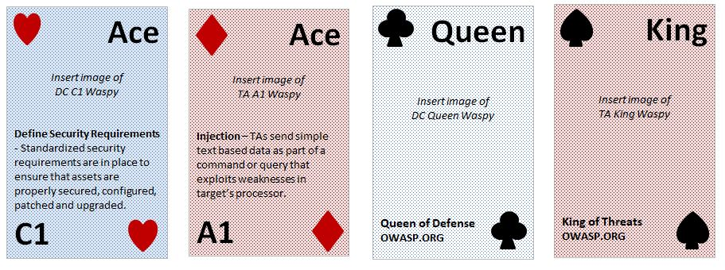

The OWASP Top Ten card game is a fun to play poker deck card game that pits the black hats against the white hats to see who can be the first to hack their opponent’s website.

Using a standard poker card deck, design a card game that combines the concepts of the <strong>OWASP Top 10</strong> and the <strong>OWASP Top 10 Proactive Controls</strong>, for novice level learners, that can be easily converted for use with customized OWASP branded playing cards.

The game is designed to be an easy to learn introduction to the risk concepts of the OWASP Top Ten and the best practices control concepts of the OWASP Top Ten Proactive Controls at a novice level in an environment that reflects a sense realism and excitement.

Many options are open for the design of an OWASP branded TA and DC card decks. Cybersecurity activities and training are frequently designed around the concept of red (attacking) and blue (defending) teams. For example,

<strong>Threat Agent (TA) Card Deck</strong>

During the initial game design, red was selected as the primary color for the malicious Threat Agent (TA) (OWASP Top 10) card deck. 

 
<strong>Defense Control (DC) Card Deck</strong>

During the initial game design, blue was selected as the primary color for the blue cybersecurity Defense Control (DC) team (OWASP Top 10 Proactive Controls) card deck.
 
## What is the OWASP Top 10 Card Game?

1. The game is designed to be an easy to learn introduction to the risk concepts of the OWASP Top Ten and the best practices control concepts of the OWASP Top Ten Proactive Controls at a novice level in an environment that reflects a sense realism and excitement.

2. The OWASP Top 10 Card Game is a documentation project that seeks to further OWASP goals and raise awareness about application security. Spin-offs from this project may take any media form (e.g. CBT, videos, games, etc.) and are not limited to a print deliverable.

3. The OWASP Top 10 Card Game is currently in the Incubator category. Ideas are being fleshed out and proven. Development is still underway.

4. The OWASP Top 10 Card Game is a documentation project that seeks to further OWASP goals and raise awareness about application security. Spin-offs from this project may take any media form (e.g. CBT, videos, games, etc.) and are not limited to a print deliverable.

<h2 id="available_presentations">Available Presentations</h2>

[Insert links here]

 
<h2 id="project_leaders">Project Leaders</h2>
 

<a href="mailto://dennis.johnson@owasp.org">Dennis Johnson</a>

 
<h2 id="project_volunteers">Project Volunteers</h2>

[Insert names here]

 
<h2 id="project_resources">Project Resources</h2>

[Insert links here]

  
<h2 id="available_downloads">Available Downloads</h2>

[Insert links here]

<h2 id="current_news_and_events">Current News and Events</h2>

[Insert information here]

<h2 id="project_sponsors">Project Sponsors</h2>

[Insert logos here]

## Related OWASP Projects

* [OWASP Top Ten Proactive Controls (2018)](https://www.owasp.org/index.php/OWASP_Proactive_Controls)
* [OWASP Top Ten Risks (2017)](http://www.owasp.org/index.php/Category:OWASP_Top_Ten_Project)
 
## Game Overview

The game is designed to be an easy to learn introduction to the risk concepts of the OWASP Top Ten and the best practices control concepts of the OWASP Top Ten Proactive Controls at a novice level in an environment that reflects a sense realism and excitement.

  - The OWASP Top 10 focuses on identifying the most serious web application security risks for a broad array of organizations. A primary aim of the OWASP Top 10 is to educate developers, designers, architects, managers, and organizations about the consequences of the most common and most important web application security weaknesses.

  - The OWASP Top 10 Proactive Controls is similar to the OWASP Top 10 but is focused on defensive techniques and controls as opposed to risks. Each OWASP Top 10 Proactive Control technique maps to one or more items in the OWASP Top 10.

The four main components of the game include:

  - Threat Agent (TA) deck
  - Defense Control (DC) deck
  - Game Play Grid
  - Game Rules and Instructions

The objective of the game is to take control of (PWN) your opponent’s three business websites while protecting your business websites. It is possible to knockout all three of your opponents TA attack websites. Primary requirements for the game are that it be designed around the standard set of playing cards so that the general public is familiar with the medium facilitating internationalization and that the play grid fit easily on the standard sized card table.

The standard two player configuration includes one TA deck and one DC deck for each gamer. The Threat Agent (TA) deck includes two Joker cards that are used to represent a Phishing attack. This brings the TA’s deck to a total of 54 cards. The Defense Control (DC) deck also includes two joker cards that are used to represent White Hat defensive controls. This also brings the DC deck to a total of 54 cards.

## Game Play Grid

The game’s detailed play grid is based in part on the attack path flow diagram provided with OWASP’s Top 10 publication. The
play grid is designed to help students visualize how threat agents can potentially use many different paths through your application to do harm to your business or organization. With a view from 3,000 meters high, the standard two player (four deck)
version of the play grid can be summarized as follows:

The following detailed version of the play grid contains instructional content and provides visual continuity for players:

<strong>OWASP Card Game Grid</strong> 

## Cards

During game design, four standard poker size playing card decks were used. Each player has one Threat Agent (TA) deck that represents the player’s attack team and one Defense Control (DC) deck that represents the player’s website defense team. Red TA decks and blue DC decks were used during game design.

<strong>Threat Agent (TA) attack deck – 54 cards</strong>

  - 12 Face Cards: The face cards (4 Suits X 3 = 12) are held in a separate deck. The players select their unique combination that must include one Jack, one Queen, and one King. The remaining 9 cards are set aside.
  - 40 TA Attack Cards: There are 40 cards (4 Suits X 10 = 40) that are included in the primary TA attack deck. The 12 face cards are not included in the 40 card TA attack deck.
  - 2 Joker Cards: There are 2 Joker cards included in the primary TA attack deck.

<strong>Defense Control (DC) deck – 54 cards</strong>

  - 12 Face Cards: The face cards (4 Suits X 3 = 12) are held in a separate deck. The players select their unique combination that must include one Jack, one Queen, and one King. The remaining 9 cards are set aside.
  - 40 DC Cards: There are 40 cards (4 Suits X 10 = 40) that are included in the primary DC deck. The 12 face cards are not included in the 40 card DC defense deck.
  - 2 Joker Cards: There are 2 Joker cards included in the primary DC deck.

Strength and weaknesses may vary among face cards (Jack, Queen, and King), suits (Clubs, Spades, Diamonds, and Hearts), card colors (black and red) and the site card’s face up/down position. Clubs and Spades are black and Diamonds and Hearts are red. Other colors can be substituted as needs require. The game is designed around the standard international, four suit, and two color (red and black) poker deck.

The Masked / Unmasked status (face down / face up) of the attacking and defending sites will affect the strength and weaknesses of the opposing sites (face cards). Face down TA site cards may have more flexible attack options and may be more difficult to defense and face down DC site cards may limit some TA attacks or trigger additional TA workload counts. The following design, of an OWASP branded card set, was drafted during the initial proof of concept phase to provide how the cards might look.

<strong>Sample of Card Fronts</strong>.
 
## Setup

The game’s play grid should be laid out at the start of each game and each player should have ready:

  - Two draw card stacks (one TA team and one DC team).
  - Two empty discard card stacks (one TA team and one DC team).
  - Two 5 card hands (one TA team and one DC team). After shuffling, each player selects the top 5 cards from each of their two 40 card decks.
  - Three DC site face cards should be positioned face down on the playing grid, one in each of the three Business Site positions.
    These cards should include one Jack, one Queen, and one King of any suit. Individual player strategy will determine the suit mixture.
  - Three TA site face cards should be positioned face down, one in each of the TA offline bays. These cards should include one Jack, one Queen, and one King of any suit. Individual player strategy will determine the suit mixture.
  - Each TA face card should be accompanied by a workload counter (dice) or small piece of paper to keep track of the workload counts.

## Start of Play

1.  The three DC site face cards (business websites) are considered online. The DC business site cards will be turned face up as they fall victim to a successful TA Observation attack.

2.  Each player must move at least one of their TA site face cards (attacking site) from the inactive offline rack to the primary online position. The cost is one workload count added to each TA face card moved to an online position. All three TA site face cards may be moved into an online position at the cost of one workload count each.

3.  A coin toss (rock, paper, scissors, etc.) determines who starts game play with the first attack.

## Attack Phase

The focus of the game is on the TA’s attack phase. The game objective is to attack and defeat (PWN) your opponent’s three DC business websites. At the start of each TA attack round, each player draws sufficient cards to ensure they have 5 cards in both the TA attack hand and the DC business hand. The TA selects an attack card (A1 through A9). If the DC opponent is unable to defense the attack card, the attack is successful. See the Card Attack / Defense Matrix and the instructions about TA Exploit Activities below.

The TA may withdraw the current primary online attack face card and replace it with another attack face card from the online rack at no cost. Whenever a card is moved from the offline rack to the online rack, one workload counter should be added to the card moved online. There is no cost to reposition an online card or return an online card to the offline position.

  - If the move to online results in more than x workload counts, the TA’s online card is no longer effectively masked (considered deprecated) and it is turned face up. Some attacks may be limited. 
  - If the move to online results in more than x workload counts, the TA’s online card is considered decommissioned and must be returned to the offline rack bay.
  - Once turned face up, the TA face card remains face up.

The TA’s attacking card (A1 through A9 and attached A10) is maintained on the grid position marking the successful exploit. The DC loser has the option to name any one of the Top 10 Proactive Controls chosen by the opponent. If correct, two DC cards may be drawn. If incorrect, one DC card may be drawn. The DC player discards any cards in excess of 5.

When the TA’s attack is defeated:

  - Both the attacking TA card (including any attached A10 card) and the defending DC card are moved to their respective discard piles.
  - The TA's attacking site card earns one workload count.
  - The DC victor is permitted to draw up to three bonus DC cards for the TA’s attack failure. The DC player discards any cards in excess of 5.
  - The defeated TA has the option to name any one of the Top 10 risks chosen by the opponent. If correct, no workload count is applied. If incorrect two workload counts are applied to the TA face card. The TA player may use the “hint” table. At the executive level of play, the "hint" table is not permitted.

TA card status:

  - Inactive – Offline rack bay (face down).
  - Active – Online and masked (face down).
  - Active – Online and unmasked/deprecated (face up).
  - Decommissioned – Offline rack bay (face up).

There are three attack vector pathways. Each pathway includes three defense-in-depth controls that must be defeated:

1.  <strong>Technology Infrastructure</strong> - The suit colors (red and black) represent different technology infrastructures. Infrastructure. Attack and defense options, strengths and weaknesses may result from color combinations. TAs learn about company weaknesses by using different paths to exploit business, social and technical weaknesses. Each of these paths represents a risk that may, or may not, be serious. Sometimes these paths are trivial to find and exploit, and sometimes they are extremely difficult.

2.  <strong>Web Platform</strong> - The card suits (Clubs, Spades, Diamonds, & Hearts) represent different web platforms. Web platform attack and defense options, strengths and weaknesses may result from suit combinations. After gaining an understanding of the technologies that support the DC’s web platform, malware can be crafted to exploit weaknesses and misconfigurations.

3.  <strong>Web Application</strong> - The face cards (Jack, Queen and King) represent sites with different business purposes and different web application layer configurations. Application layer component attack and defense options, strengths and weaknesses may result from face card combinations. The web application layer includes the user interface and other critical functions that if exploited could permit the TA to control the site.

## Threat Agent (TA) Exploit Activities

Exploits are designed around five TA team activities (three attacks and two phases):

1.  Observation Attack
2.  Weaponization Phase
3.  Assess Web Platform Technical Weaknesses Attack
4.  Site Application Weakness Evaluation Phase
5.  PWN Attack

<strong>Observation Attack</strong> – This includes the concepts of profiling, research, and crafting a reconnaissance strategy. If the TA's Observation Attack is successful, the TA moves to the Weaponization phase. When an Observation exploit is defeated by an effective DC card, the attack round is over. See instructions above for when an attack is defeated.

<strong>Weaponization Phase</strong> – Based on the results of the Observation phase, the TA will select the best tools and techniques to achieve a presence in the system and to eventually gain system exploit. At the beginning of the Weaponization phase, the TA has several options:

1.  End the round without additional workload cost.
2.  Draw up to 3 additional attack cards. After selecting the best cards for the planned exploit, the TA must discard attack cards so the hand has no more than 5 cards. The cost of the additional card draw is to add one workload count to the TA's attacking face card.
3.  Move online TA face card(s) offline. No cost.
4.  Move offline TA face card(s) online. Cost is one workload count per card.
5.  Reposition the TA’s primary online face card to another online position and substitute it with another online card. No cost.
6.  Change attack vector path and launch an Observation Attack on another DC site. No cost.
7.  Launch an Assess Platform Weakness Attack on this site or change the attack vector path and launch an Assess Platform Weakness Attack on any other DC site that is vulnerable due to a previously successful Observation attack. No cost.
8.  Change attack vector path and launch a PWN Attack on any other DC site that is now vulnerable due to a previously successful Assess Platform Weakness Attack. No cost.

<strong>Assess Web Platform Technical Weaknesses Attack</strong> – The purpose of this attack is to evaluate the information gained from the previous phase, craft an effective attack, and assess the technical weaknesses of the opponents DC site web platform. If the attack is successful, the TA moves to the Site Application Weakness Evaluation phase. If the TA's technical weakness attack is defeated, the round is over. See instructions for when an attack phase is defeated.

<strong>Site Application Weakness Evaluation Phase</strong> – The purpose of this phase is to evaluate the information gained from the previous phases and craft an attack that will effectively implement the TA’s goals. At the beginning of the Site Application Weakness Evaluation phase, the TA has several options:

1.  End the round without additional workload cost.
2.  Draw up to 3 additional attack cards. After selecting the best cards for the planned exploit, the TA must discard attack cards so the hand has no more than 5 cards. The cost of the additional card draw is to add one workload count to the TA's attacking face card.
3.  Move online TA face card(s) offline. No cost.
4.  Move offline TA face card(s) online. Cost is one workload count per card.
5.  Reposition the TA’s primary online face card to another online position and substitute it with another online card. No cost.
6.  Change attack vector path and launch an Observation Attack on another DC site. No cost.
7.  Change attack vector path and launch an Assess Platform Weakness Attack on another DC site that is vulnerable due to a previously successful Observation attack. No cost.
8.  Launch a PWN Attack on this site or change the attack vector path and launch a PWN attack on any other DC site that is now vulnerable due to a previously successful Assess Platform Weakness Attack. No cost.

<strong>PWN Attack</strong> – The potential results and future actions following the TA’s PWN attack depend on the status of the TA's attacking face card:

  - If the TA PWN attack is successful, the TA may move to another vector path and launch an attack on another DC site or end the round without additional workload cost.
  - If the TA is attacking with a face card that is unmasked/deprecated, some attacks may be limited.
  - If the TA is attacking with a face card that is not unmasked/deprecated and the PWN attack is successful, the TA may
    also pivot and PWN any of the opponent’s unmasked/deprecated online TA face cards prior to launching an attack in another path vector or ending the round. At the start of the next round, the PWN’d TA face cards (now considered decommissioned) must be returned to the offline rack bay.

If the TA's PWN exploit is defeated, the round is over. See instructions
for when an attack phase is defeated.

## Card Attack / Defense Matrix

| Attack / TA Card | Treat Agent (TA) Point of View | Defense / DC Card | DC Defense Control Concepts      |
| ------------------ | ------------------------------ | ------------------- | -------------------------------- |
| A1 / Ace         |<strong>Injection</strong> – TAs send simple text based data as part of a command or query that exploits the syntax rules of the targeted system’s interpreter. Many DC teams continue to allow the use of unsafe APIs and are lax in reviewing legacy code for injection flaws, keeping data separate from commands and limiting SQL injection mass disclosures.| C3 / 3            |<strong>Secure Database Access</strong> - Untrusted data and input is properly controlled and handled by database and platform authentication and communication controls.|
| A1 / Ace         |<strong>Injection</strong> – TAs send simple text based data as part of a command or query that exploits the syntax rules of the targeted system’s interpreter. Many DC teams continue to allow the use unsafe APIs and are lax in reviewing legacy code for injection flaws, keeping data separate from commands and limiting SQL injection mass disclosures.| C3 / 3            |<strong>Encode and Escape Data</strong> - Applications are designed to encode and escape data to ensure that TA crafted scripts are prevented from hijacking the intended process.|
| A2 / 2           |<strong>Broken Authentication</strong> – System flaws allow TAs to compromise passwords, keys, or session tokens, or to assume other users’ identities. Privileged accounts are frequently targeted. The prevalence of broken authentication is widespread across the DC landscape due to poor design and weak implementation of identity and access controls. Effective reconnaissance will help identify systems that may be using admin default credentials.| C6 / 6            |<strong>Implement Digital Identity</strong> - Properly configured user authentication and session management controls are in place to ensure that only legitimate users and processes are permitted.|
| A3 / 3           |<strong>Sensitive Data Exposure</strong> – TAs steal clear text data off the server, while in transit, or from the users browser. Over the last few years, this attack has seen successful TA exploits. DC teams are not ensuring that business sensitive data is encrypted. Sensitive data maybe stored or cached long after it is needed for any business purpose. When crypto is employed, weak key generation and management, and weak algorithm, protocol and cipher usage is common, particularly for weak password hashing storage techniques. For data in transit, server side weaknesses are mainly easy to detect, but hard for data at rest.| C8 / 8            |<strong>Protect Data Everywhere</strong> - A process is in place to ensure that sensitive user; platform and application data is properly classified, encrypted and controlled.|
| A4 / 4           |<strong>XML External Entities (XXE)</strong> - TAs upload hostile content to XML processors or documents. DC management continues to disregard this risk and frequently fails to support funding for Web Application Firewalls, XXE testing and essential developer training to identify and mitigate XXE.| C4 / 4            |<strong>Encode and Escape Data</strong> - Applications are designed to encode and escape data to ensure that TA crafted scripts are prevented from hijacking the intended process.|
| A5 / 5           |<strong>Broken Access Control</strong> – TAs know that flawed applications and APIs may allow users to move beyond management’s intended permissions. Access control weaknesses are common due to the lack of automated detection and effective functional testing by application developers.| C7 / 7            |<strong>Enforce Access Controls</strong> - Steps have been taken to ensure that user roles are properly managed and that need-to-know and data sensitivity access controls are properly configured.|
| A6 / 6           |<strong>Security Misconfiguration</strong> – TAs exploit unpatched flaws or access default accounts, unused pages, unprotected files and directories to gain unauthorized access or knowledge of the system. Without a robust and mature DC process, it is virtually impossible for companies to properly harden all assets resulting in application stack security misconfigurations permitting successful exploits of network services, platforms, web servers, application servers, databases, frameworks, custom code, and pre-installed virtual machines, containers, or storage.| C1 / Ace          |<strong>Define Security Requirements</strong> - Standardized security requirements are in place and supported by adequate resources to ensure that assets are properly secured, configured, patched and upgraded.|
| A7 / 7           |<strong>Cross-Site Scripting (XSS)</strong> – TA input is not prevented from updating a web page with malicious data resulting in hijacked user sessions, defaced web sites, redirected users and malware. DC teams are not following the OWASP XSS Prevention Cheat Sheet and TAs around the globe are leveraging this risk. It is found in approximately two-thirds of all applications.| C4 / 4            |<strong>Encode and Escape Data</strong> - Applications are designed to encode and escape data to ensure that TA crafted scripts are prevented from hijacking the intended process.|
| A8 / 8           |<strong>Insecure Deserialization</strong> – TAs exploit weaknesses in applications and APIs that permit the deserialization of hostile TA data. TA exploitation of deserialization is difficult, as off the shelf exploits rarely work without changes or tweaks to the underlying exploit code.| C5 / 5            |<strong>Validate All Inputs</strong> - Processing controls are in place to prevent the server-side handling of invalid input and design controls are in place to minimize the use of serialized data formats.|
| A9 / 9           |<strong>Known Vulnerabilities</strong> - TAs identify weak components through scanning or manual analysis and customize attack exploits. Prevalence of this issue in the business community is widespread. Component-heavy development patterns has resulted in development teams not understanding which components they use in their application or API, much less keeping them up to date. DC teams may be limited in their efforts to scan, identify and remove unnecessary functions and monitor libraries.| C2 / 2            |<strong>Leverage Security Frameworks and Libraries</strong> - Only trusted frameworks and libraries with solid security features are employed.|
| Black Hat / Joker| <strong>Phishing attack</strong> - Phishing controls include day-to-day procedures and education but are rarely designed with the holistic view necessary to mount an effective defense. There are few DC precautions that application writers can follow to reduce this risk. DC and business management have historically been lax in addressing phishing controls.| None / None       |<strong>User Education</strong> - Effective DC actions to blunt a phishing attack are limited.|
| A10 / 10         |<strong>Leverage Poor Logging & Monitoring Controls</strong> - TAs rely on ineffective application runtime security logging, inconsistent operational data reviews, and the poor overall management of monitoring activities, coupled with weak responses by the DC team, to achieve their goals without being detected. This card represents additional malware that supports the attack card (A1 through A9). It is used during the attack phase. It is not a stand-alone attack card. The A10 card may be added to support the TA’s attack card during the current or subsequent attack rounds. The A10 card may only be played during an Assess Web Platform Technical Weaknesses Attack or PWN Attack. The TA’s A10 card may be any color.|
|                  |                                | C9 / 9            |<strong>Logging and Monitoring</strong> - This card represents the effective logging and monitoring of the web platform’s operational data and application’s processing activities.     |
|                  |                                |                   |The C9 Logging and Monitoring DC card cancels TA attacks (1 through 9) unless the attack vector path (1, 2 or 3) is poisoned by the A10 malware card.                  |
|                  |                                |                   |The C9 card may be any color.     |
|                  |                                |                   |The C9 defense is not effective if the TA attacking site is masked.                                                                                                    |
|                  |                                |                   |The C9 card can only be played during the Assess Web Platform Technical Weaknesses Attack and the PWN Attack.                                                            |
|                  |                                | C10 / 10          |<strong>Error and Exception Handling</strong> - With this card, controls are in place to ensure that the application’s error and exception handling process does not leak system information and that it is guarded from malicious system overload.                                                                            |
|                  |                                |                   |The C10 card may be any color.    |
|                  |                                |                   |The C10 Error Handling DC card cancels TA attacks (1 through 9) unless the DC’s face card attack vector path (1, 2 or 3) is poisoned by the A10 malware card.           |
|                  |                                |                   |The C10 card can only be played during the Assess Web Platform Technical Weaknesses Attack and the PWN Attack.                                                            |
|                  |                                | White Hat / Joker |The DC White Hat Joker card can be played any time while under attack to prevent a phishing attack or a pivot move in the assigned vector path. Once in play, the DC White Hat Joker card cannot be moved from the assigned position.                                                                          |

| <strong>Special Attack and Defense Rules</strong>                                                                                                                                                                                                                                                                                                                         |
| -------------------------------------------------------------------------------------------------------------------------------------------------------------------------------------------------------------------------------------------------------------------------------------------------------------------------------------------------------- |
| <strong>Observation Attack</strong> - If the TA site is not masked, the color of TA’s attacking card (A1 through A9) must match the color (red or black) of the TA’s attack site card. For example, an attacking unmasked TA Queen of Hearts (Red) may only use a Red (Diamond or Heart) attack (A1 through A9) card.                                                     |
| <strong>Assess Web Platform Technical Weaknesses Attack</strong> - If the TA site is not masked, the suit of the TA’s attacking card (A1 through A9) must match the suit (hearts, diamonds, spades, or clubs) of the defending DC site card.                                                                                                                              |
| <strong>PWN Attack</strong> - If the TA site is not masked, the attacking TA site (Queen or King) must match the face card (Queen or King) of the defending DC site card. An unmasked Jack may still attack any other face card. For example, an attacking unmasked TA Queen of Hearts may only launch a PWN attack against a DC Queen (Hearts, Diamond, Club or Spades). |

## Card Attack / Defense Matrix

| Attacks| TA Playing Card| Threat Agent (TA) Point of View      | Proactive DC| DC Playing Card| Defense Control (DC) Concepts|
|--------|----------------|--------------------------------------|-------------|----------------|------------------------------|
|A1      |Ace             |Injection – TAs send simple text based data as part of a command or query that exploits the syntax rules of the targeted system’s interpreter. Many DC teams continue to allow the use of unsafe APIs and are lax in reviewing legacy code for injection flaws, keeping data separate from commands and limiting SQL injection mass disclosures. |C3      |3       |<strong>Secure Database Access</strong> - Untrusted data and input is properly controlled and handled by database and platform authentication and communication controls.|
|A1      |Ace|Injection – TAs send simple text based data as part of a command or query that exploits the syntax rules of the targeted system’s interpreter. Many DC teams continue to allow the use unsafe APIs and are lax in reviewing legacy code for injection flaws, keeping data separate from commands and limiting SQL injection mass disclosures.|C4|4|<strong>Encode and Escape Data</strong> - Applications are designed to encode and escape data to ensure that TA crafted scripts are prevented from hijacking the intended process.|
|A2      |2|Broken Authentication – System flaws allow TAs to compromise passwords, keys, or session tokens, or to assume other users’ identities. Privileged accounts are frequently targeted. The prevalence of broken authentication is widespread across the DC landscape due to poor design and weak implementation of identity and access controls. Effective reconnaissance will help identify systems that may be using admin default credentials.|C6|6|<strong>Implement Digital Identity</strong> - Properly configured user authentication and session management controls are in place to ensure that only legitimate users and processes are permitted.|
|A3      |3|Sensitive Data Exposure – TAs steal clear text data off the server, while in transit, or from the users browser. Over the last few years, this attack has seen successful TA exploits. DC teams are not ensuring that business sensitive data is encrypted. Sensitive data maybe stored or cached long after it is needed for any business purpose. When crypto is employed, weak key generation and management, and weak algorithm, protocol and cipher usage is common, particularly for weak password hashing storage techniques. For data in transit, server side weaknesses are mainly easy to detect, but hard for data at rest.|C8|8|<strong>Protect Data Everywhere</strong> - A process is in place to ensure that sensitive user; platform and application data is properly classified, encrypted and controlled.|
|A4      |4|XML External Entities (XXE) - TAs upload hostile content to XML processors or documents. DC management continues to disregard this risk and frequently fails to support funding for Web Application Firewalls, XXE testing and essential developer training to identify and mitigate XXE.|C4|4|<strong>Encode and Escape Data</strong> - Applications are designed to encode and escape data to ensure that TA crafted scripts are prevented from hijacking the intended process.|
|A5      |5|Broken Access Control – TAs know that flawed applications and APIs may allow users to move beyond management’s intended permissions. Access control weaknesses are common due to the lack of automated detection and effective functional testing by application developers.|C7|7|<strong>Enforce Access Controls</strong> - Steps have been taken to ensure that user roles are properly managed and that need-to-know and data sensitivity access controls are properly configured.|
|A6      |6|Security Misconfiguration – TAs exploit unpatched flaws or access default accounts, unused pages, unprotected files and directories to gain unauthorized access or knowledge of the system. Without a robust and mature DC process, it is virtually impossible for companies to properly harden all assets resulting in application stack security misconfigurations permitting successful exploits of network services, platforms, web servers, application servers, databases, frameworks, custom code, and pre-installed virtual machines, containers, or storage.|C1|Ace|<strong>Define Security Requirements</strong> - Standardized security requirements are in place and supported by adequate resources to ensure that assets are properly secured, configured, patched and upgraded.|
|A7      |7|Cross-Site Scripting (XSS) – TA input is not prevented from updating a web page with malicious data resulting in hijacked user sessions, defaced web sites, redirected users and malware. DC teams are not following the OWASP XSS Prevention Cheat Sheet and TAs around the globe are leveraging this risk. It is found in approximately two-thirds of all applications.|C4|4|<strong>Encode and Escape Data</strong> - Applications are designed to encode and escape data to ensure that TA crafted scripts are prevented from hijacking the intended process.|
|A8      |8|Insecure Deserialization – TAs exploit weaknesses in applications and APIs that permit the deserialization of hostile TA data. TA exploitation of deserialization is difficult, as off the shelf exploits rarely work without changes or tweaks to the underlying exploit code.|C5|5|<strong>Validate All Inputs</strong> - Processing controls are in place to prevent the server-side handling of invalid input and design controls are in place to minimize the use of serialized data formats.|
|A9      |9|Known Vulnerabilities - TAs identify weak components through scanning or manual analysis and customize attack exploits. Prevalence of this issue in the business community is widespread. Component-heavy development patterns has resulted in development teams not understanding which components they use in their application or API, much less keeping them up to date. DC teams may be limited in their efforts to scan, identify and remove unnecessary functions and monitor libraries.|C2|2|<strong>Leverage Security Frameworks and Libraries</strong> - Only trusted frameworks and libraries with solid security features are employed.|
|Black Hat|Joker|Phishing attack – Phishing controls include day-to-day procedures and education and are rarely designed with the holistic view necessary to mount an effective defense. There are few DC precautions that application writers can follow to reduce this risk. DC and business management have historically been lax in addressing phishing controls.|None||<strong>User Education</strong> - Effective DC actions to blunt a phishing attack are limited.|
|A10     |10|Leverage Poor Logging & Monitoring Controls - TAs rely on ineffective application runtime security logging, inconsistent operational data reviews, and the poor overall management of monitoring activities, coupled with weak responses by the DC team, to achieve their goals without being detected. This card represents additional malware that supports the attack card (A1 through A9). It is used during the attack phase. It is not a stand-alone attack card. The A10 card may be added to support the TA’s attack card during the current or subsequent attack rounds. The A10 card may only be played during an Assess Web Platform Technical Weaknesses Attack or PWN Attack. The TA’s A10 card may be any color.|
|        |||C9|9|Logging and Monitoring - This card represents the effective logging and monitoring of the web platform’s operational data and application’s processing activities.
|        |||||
|        |||||The C9 Logging and Monitoring DC card cancels TA attacks (1 through 9) unless the attack vector path (1, 2 or 3) is poisoned by the A10 malware card.
|        |||||
|        |||||The C9 card may be any color.
|        |||||
|        |||||The C9 defense is not effective if the TA attacking site is masked.
|        |||||
|        |||||The C9 card can only be played during the Assess Web Platform Technical Weaknesses Attack and the PWN Attack.
|        ||White Hat|C10|10|Error and Exception Handling - With this card, controls are in place to ensure that the application’s error and exception handling process does not leak system information and that it is guarded from malicious system overload.
|        |||||
|        |||||The C10 card may be any color.
|        |||||
|        |||||The C10 Error Handling DC card cancels TA attacks (1 through 9) unless the DC’s face card attack vector path (1, 2 or 3) is poisoned by the A10 malware card.
|        |||||
|        |||||The C10 card can only be played during the Assess Web Platform Technical Weaknesses Attack and the PWN Attack.
|        ||||Joker|DC White Hat Joker - The DC White Hat Joker card can be played any time while under attack to prevent a phishing attack or a pivot move in the assigned vector path. Once in play, the DC White Hat Joker card cannot be moved from the assigned position.

| <strong>Special Attack and Defense Rules</strong>                                                                                                                                                                                                                                                                                                                         |
| -------------------------------------------------------------------------------------------------------------------------------------------------------------------------------------------------------------------------------------------------------------------------------------------------------------------------------------------------------- |
| <strong>Observation Attack</strong> - If the TA site is not masked, the color of TA’s attacking card (A1 through A9) must match the color (red or black) of the TA’s attack site card. For example, an attacking unmasked TA Queen of Hearts (Red) may only use a Red (Diamond or Heart) attack (A1 through A9) card.                                                     |
| <strong>Assess Web Platform Technical Weaknesses Attack</strong> - If the TA site is not masked, the suit of the TA’s attacking card (A1 through A9) must match the suit (hearts, diamonds, spades, or clubs) of the defending DC site card.                                                                                                                              |
| <strong>PWN Attack</strong> - If the TA site is not masked, the attacking TA site (Queen or King) must match the face card (Queen or King) of the defending DC site card. An unmasked Jack may still attack any other face card. For example, an attacking unmasked TA Queen of Hearts may only launch a PWN attack against a DC Queen (Hearts, Diamond, Club or Spades). |

## TA Hint Table

| OWASP Top 10 Risks | TA Playing Card | TA Hint | OWASP Top 10 Risks        |
| ------------------ | --------------- | ------- | ------------------------- |
| A1                 | Ace             | I       | Injection                 |
| A2                 | 2               | BA      | Broken Authentication     |
| A3                 | 3               | SDE     | Sensitive Data Exposure   |
| A4                 | 4               | XXE     | XML External Entities     |
| A5                 | 5               | BAC     | Broken Access Control     |
| A6                 | 6               | SM      | Security Misconfiguration |
| A7                 | 7               | XXS     | Cross Site Scripting      |
| A8                 | 8               | ID      | Insecure Deserialization  |
| A9                 | 9               | KV      | Known Vulnerabilities     |
| A10                | 10              | L\&M    | Logging & Monitoring      |

## DC Hint Table

| OWASP Top 10 Proactive Controls | DC Playing Card | DC Hint | OWASP Top 10 Proactive Controls            |
| ------------------------------- | --------------- | ------- | ------------------------------------------ |
| C1                              | Ace             | DSR     | Define Security Requirements               |
| C2                              | 2               | LSF\&L  | Leverage Security Frameworks and Libraries |
| C3                              | 3               | SDA     | Secure Database Access                     |
| C4                              | 4               | E\&ED   | Encode and Escape Data                     |
| C5                              | 5               | VAI     | Validate All Inputs                        |
| C6                              | 6               | IDI     | Implement Digital Identity                 |
| C7                              | 7               | EAC     | Enforce Access Controls                    |
| C8                              | 8               | PDE     | Protect Data Everywhere                    |
| C9                              | 9               | ISL\&M  | Implement Security Logging and Monitoring  |
| C10                             | 10              | HAE\&E  | Handle All Errors and Exceptions           |

## Licensing

This card game is free to use. It is licensed under the Creative Commons Attribution ShareAlike 3.0 license, so you can copy, distribute and transmit the work, and you can adapt it, and use it commercially, but all provided that you attribute the work and if you alter, transform, or build upon this work, you may distribute the resulting work only under the same or similar license to this one.

Special customized card decks are available through OWASP. These are standard poker decks that have been modified to enhance the game’s
learning experience. These decks and the related play grid contain OWASP copyrighted images and related descriptions and all rights are reserved. Generally, these decks (and play grid) are updated as the new versions of the OWASP Top 10 are released. All profit derived from the sale of the customized decks (and other related items) are used to further OWASP global efforts. See \[add reference / link here\] for additional information and examples.

## Roadmap

Phase 1 - Develop and complete proof of concept, mission statement, short term goals, long term goals and a basic game prototype.
**Completed April 2019**

Phase 2 - Provide proof of concept and mission statement to OWASP and obtain Foundation's permission to move forward. Set up project GitHub page and adding the project to the OWASP project inventory (Incubator Status). **Completed April 2019**

Phase 3 - Follow OWASP best practices and keep project materials up-to-date. Find other people to help lead and contribute to the
project. Areas of need and the corresponding volunteer are listed in the “Getting Involved” section. **Open**

Phase 4 - Complete one version of a concrete deliverable (product is of value to users and the software security industry) and graduate to Lab Stage. **Open**

Phase 5 - Gain OWASP community and Technical Project Advisory Group support and move the project to the Flagship phase. **Open**

Phase 6 - Phase 6 addresses the project’s long team goals. It will incorporate the basic OWASP Top 10 Card Game as presented in the
Flagship phase along with special customized card decks that will be available through OWASP. These are standard poker decks that have been modified to enhance the game’s learning experience. These decks and the related play grid contain OWASP copyrighted images and related descriptions and all rights are reserved by OWASP. **Open**

## Getting Involved

| Task                                         | Volunteer                             | Responsibilities                                                                                                                                                                                      | Status                                            |
| -------------------------------------------- | ------------------------------------- | ----------------------------------------------------------------------------------------------------------------------------------------------------------------------------------------------------- | ------------------------------------------------- |
| Technical Jargon Watchdog                    | Add name and contact information here | Plain language evangelist that facilitates learning experience for novice level learners                                                                                                              | This volunteer position is currently open         |
| Game Play Grid Layout and Design Coordinator | Add name and contact information here | Ensures that the game play grid properly supports game play and that content supports the learning experience for novice level learners                                                               | This volunteer position is currently open         |
| Game Play Instructions Coordinator           | Add name and contact information here | Ensures appropriate summarized content reflecting the OWASP Top 10 risks and proactive controls and that game content and play instructions support the learning experience for novice level learners | This volunteer position is currently open         |
| Trial Game Coordinator                       | Add name and contact information here | Look for volunteers to assist project with conducting trial games. Accumulate results from trial game sessions to determine the best number of workload counts                                        | This volunteer position is currently open         |
| Card Layout and Design Coordinator           | Add name and contact information here | Ensures that card layout and design are appropriate and meaningful and that content supports the learning experience for novice level learners                                                        | This Phase 6 volunteer position is currently open |
| Card Image and Design Coordinator            | Add name and contact information here | Ensures that the images selected for the Top Ten risks and controls are appropriate, meaningful and marketable and that content supports the learning experience for novice level learners            | This Phase 6 volunteer position is currently open |

## Lessons Learned

1.  Technical Complexity - The OWASP Top 10 and the OWASP Top Ten Proactive Controls are abstractions of complex real life technical challenges and solutions. Because the card game is a abstraction of the Top 10 risks and controls, it is important to be mindful that the game can easily grow in complexity beyond the intended scope of the novice learner.

2.  Operational Complexity - Even through the game is based on the common poker card deck and a simple game grid, there is ample opportunity for the game to grow in complexity beyond the intended scope of the novice learner.

3.  Card Formulations - During the prototype design process, it was determined that increasing or decreasing the number of attack cards based on the Top 10's risk calculation process, was not meaningful to the games's purpose and only added complexity.

4.  Heavy Lifting Already Completed by Other Teams - The game relies on the professionally developed and presented work completed by the Top 10 risk and controls project teams. Don't stray from the guidelines provided by the Top 10 risk and control projects.

5.  Use of Die - During the prototype design process, it was determined that the workload count added for each attack failure was probably best tracked by each player using a six sided die. So it is recommended that six sided dice be included in OWASP's recommended game configuration.

6.  Workload Counts - During the prototype design process, the appropriate number of workload counts (e.g., damage counters) that should be accumulated for an attacking threat agent website to be unmasked or decommissioned was not finalized. Need to accumulate results from trial game sessions to determine the best number of workload counts.

7.  Gamer Education - The purpose of the game is to provide an interesting and fun experience and also help the gamer to learn about the OWASP Top 10 risks and controls. Look for simple ways to build learning experiences into the game. For example, the design currently permits a player who has failed in their attack move to name a Top 10 risk selected by their opponent to cancel the normal workload count.

8.  Game Grid - The initial prototype was designed with a more simple grid; however, this proved to be a bit boring for the gamer. The current game grid design reflects design aspects taken from the OWASP Top 10 publication and a layered attack vector that is segmented into five defense-in-depth activities that are summarized with the mnemonic OWASP. Consider ways to modify the game grid to enhance the learning experience.

9.  Card Designs - At a minimum, the TA deck's card backs should be a color different than the DC deck. A red TA deck and a Blue DC deck seem to augment a more realistic learning experience. Using cards with the same design pattern, made it easy to mix up the player cards. Consider ways to help the players not mix up their playing cards, such as different card back patterns or maybe plastic card jackets.

[Category:OWASP Project](Category:OWASP_Project "wikilink")
[Category:OWASP_Document](Category:OWASP_Document "wikilink")
